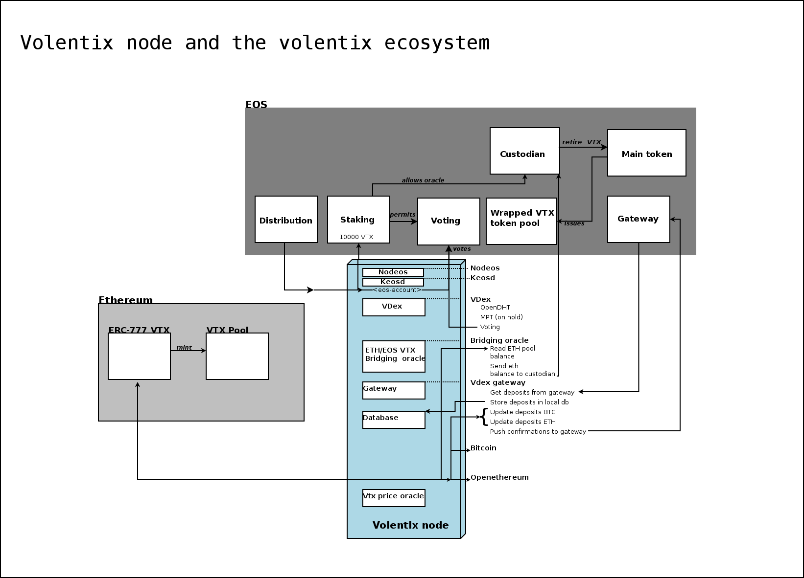

Preparation
===========

**Main accounts on Jungle testnet 2**

1.  vltxstakenow\
    *The staking contract*

2.  volentixtsys\
    *The main token contract, emulation of volentixgsys*

3.  vistribution\
    *Distribution contract*

4.  volentixvote\
    *Voting contract*

5.  volentixsale\
    Pool

**Other preparatory actions**

1.  Deploy main token on *volentixtsys*

2.  Create 2.1 million TVTX

3.  Create volentixsale testnet account and isssue balance of EOS
    volentixsale

4.  Deploy vdexdposvote contract to volentixvote + ressources

5.  Deploy vtxdistribut contract to vistribution + ressources

6.  Deploy volentixstak contract to vltxstakenow + ressources

7.  Mint 2 test pools of 100000.00000000 ERC-777 VTX on Ropsten

8.  Deploy custodian on v22222222222

9.  set v22222222222 permissions for volentixtsys

10. Initialize v22222222222 *currentbal*

11. Clear v22222222222 *balances* buffer

12. register nodes to v22222222222\

**Docker network**\

1.  eos wallet

2.  open ethereum

3.  oracle

Tests
=====

1.  **Persistency test**IN PROGRESS\

    1.  uptime

    2.  Message to network less than 8 nodes with pesistency

    3.  Iterate through 16 nodes and shut 8 down

    4.  Manage if provider is not available.

    5.  Test values from providers

2.  **Out of ressouces test**\

    1.  CPU DONE

    2.  Memory

    3.  BW

Considerations
==============

1.  

centering {#fig:whitebackground-ecosystem02}
